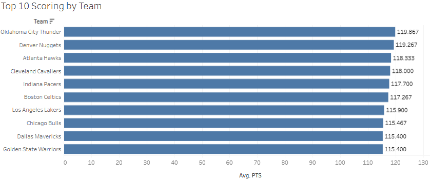
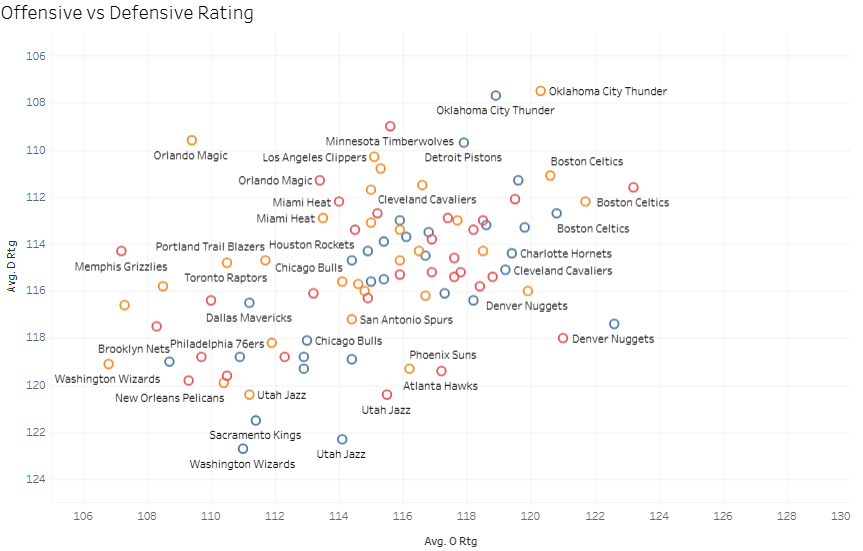
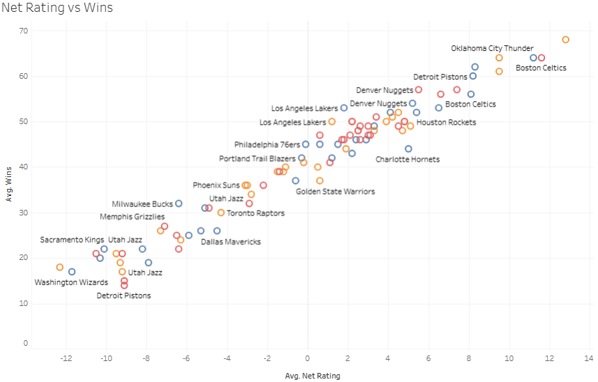

# NBA Performance Analysis 2023-2026

Looked at 3 seasons of NBA team data to figure out what actually separates 
winning teams from losing ones.

Cleaned the raw data in Python, then built the visualizations in Tableau.

## Interesting Findings 

The Oklahoma City Thunder averaged the highest scoring across all 3 seasons combined, yet never led the league in scoring in any individual season. This means OKC didn't have one dominant year that inflated their average. They were simply the most consistent offensive team in the league across the entire 3-season span.

This scatter plot compares the offensive and defensive ratings of each NBA team over three years. The most complete teams in the league are those in the top right because they have strong offenses and allow fewer points. The Boston Celtics and Oklahoma City Thunder frequently show up in that upper right corner. The Washington Wizards and Utah Jazz, two teams in the bottom left, had difficulty on both ends. The graph shows that top teams play defense as well as score.

This scatter plot shows the relationship between Net Rating and wins across 3 seasons. The trend is almost perfectly linear. Every team that had a positive Net Rating above +5 won 55 or more games. Every team below -5 was a lottery team. OKC Thunder sits at the top right with the highest Net Rating and most wins. The Washington Wizards and Detroit Pistons sit at the bottom left. This chart shows that Net Rating is not just a useful stat; it is the single most reliable predictor of whether a team wins or loses.

## Tools Used
Python: Used to load and merge 6 raw CSV files from Basketball Reference covering 3 NBA seasons
Panda: Handled all the cleaning. Removed duplicate headers, stripped playoff indicators from team names, converted columns to numeric, and built new metrics like Win Percentage and Assist to Turnover Ratio.
Tableau Public: Created three interactive charts that examined scoring, offensive and defensive effectiveness, and the connection between wins and Net Rating for each of the 30 teams.

## Dashboard
[NBA Dashboard](https://public.tableau.com/app/profile/raianul.quader/viz/NBAPerformanceAnalysis2023-2026/Dashboard1)

## Data Source
Data sourced from [Basketball Reference](https://www.basketball-reference.com). 
Stats used in accordance with their data usage policy.
